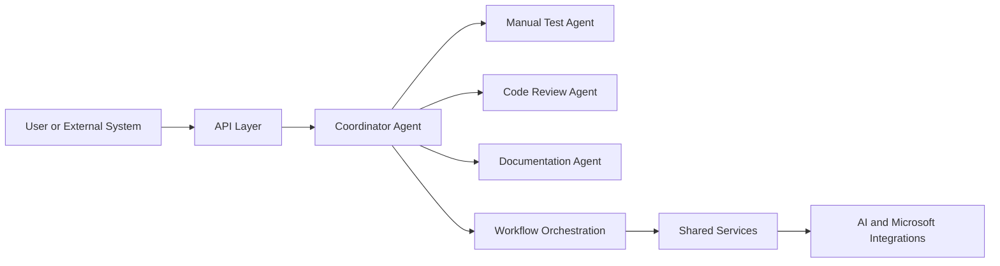

# Initial Architecture Diagram

```mermaid
flowchart LR
    User[User or External System] --> API[API Layer]
    API --> Coordinator[Coordinator Agent]
    Coordinator --> Manual[Manual Test Agent]
    Coordinator --> Review[Code Review Agent]
    Coordinator --> Docs[Documentation Agent]
    Coordinator --> Workflow[Workflow Orchestration]
    Workflow --> Shared[Shared Services]
    Shared --> Providers[AI and Microsoft Integrations]
```
