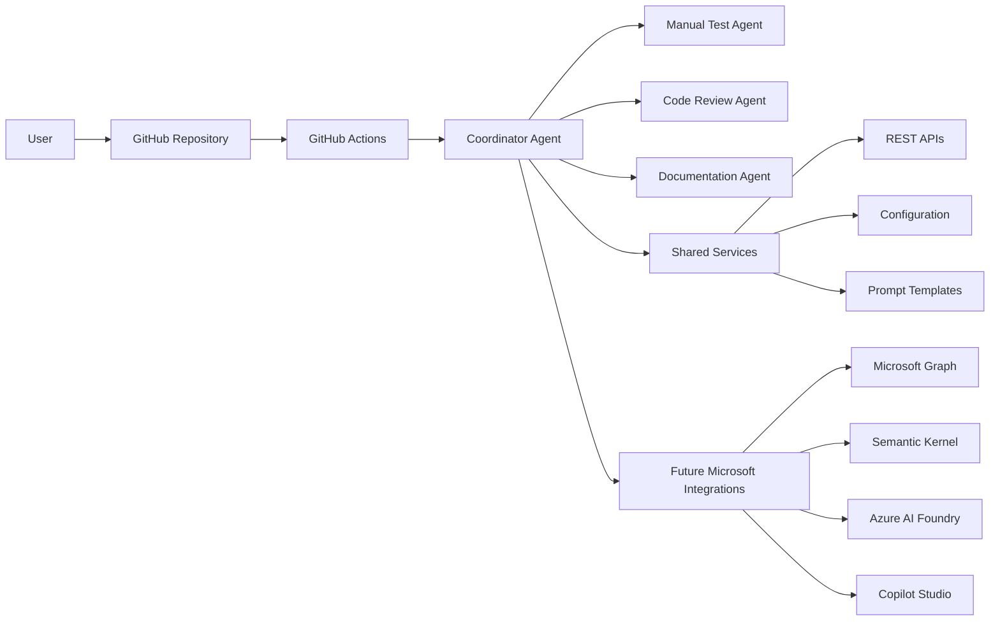

# AI Agent Automation Platform Architecture

```mermaid
flowchart LR

    User[User]
    GitHub[GitHub Repository]
    CI[GitHub Actions]

    User --> GitHub
    GitHub --> CI

    CI --> Coordinator

    Coordinator[Coordinator Agent]

    Coordinator --> Manual[Manual Test Agent]
    Coordinator --> Review[Code Review Agent]
    Coordinator --> Docs[Documentation Agent]

    Coordinator --> Shared[Shared Services]

    Shared --> API[REST APIs]
    Shared --> Config[Configuration]
    Shared --> Prompts[Prompt Templates]

    Coordinator --> Future[Future Microsoft Integrations]

    Future --> Graph[Microsoft Graph]
    Future --> SK[Semantic Kernel]
    Future --> Azure[Azure AI Foundry]
    Future --> Copilot[Copilot Studio]
```